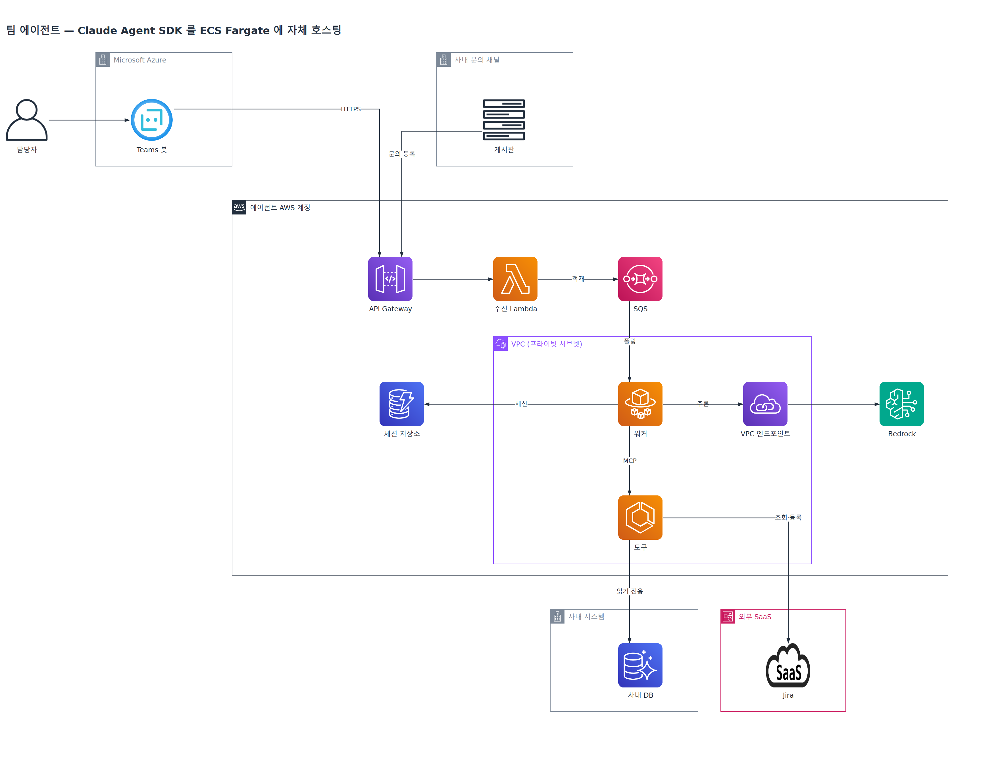
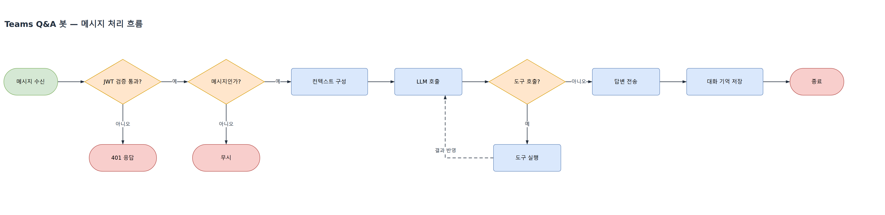

# archplot

[English](README.md) | [한국어](README.ko.md) | [简体中文](README.zh-CN.md) | [日本語](README.ja.md)

<p align="center">
  
</p>

<p align="center">
  
</p>

A Claude Code skill that draws architecture diagrams with official cloud icons from a plain
description. You get a `.drawio` file you can open and edit in draw.io, plus a PNG.

## Features

- **Official icons** — 2,440 icons across 17 families, including AWS, GCP, Azure and Kubernetes
- **Boundary boxes** — nest accounts, regions, VPCs and subnets
- **Clean lines** — edges connect at right angles, avoiding shapes and text
- **No app to install** — renders PNGs without the draw.io desktop app

## Install

```bash
npx skills add yujung7768903/archplot
```

| Requirement | Notes |
| --- | --- |
| Python 3 | Standard library only; no extra runtime dependency |
| `pip install diagrams` | Supplies the vendor icon PNGs the generator reads |
| Chromium | Auto-detected from `~/.cache/ms-playwright` or `~/.cache/puppeteer`, else system `chromium` / `chromium-browser` / `google-chrome` |

## Usage

Describe the setup you want to Claude Code.

> Draw a diagram where the order API puts orders on SQS and a Lambda picks them up and uploads receipts to S3

## Edge rules

Edges connect shapes following these rules.

| Rule | Why |
| --- | --- |
| Bend only horizontally and vertically | Curves and diagonals are hard to follow |
| Never bend when a straight line fits | A bend is not information |
| Never cut through a shape | It becomes unclear where the line ends |
| Never run over text | It hides the name |
| Never leave from an icon corner | The line looks detached from the icon |
| Incoming lines never share a connection point | Overlapping lines read as one |
| If no clean path exists, fix the layout | No forced diagonal lines |

## Drawing rules

Taken from AWS reference architecture diagrams.

- One node per resource
- Only things with an icon become nodes — no function names, URLs or field names
- Edge labels are one to three words
- Users sit outside every boundary box
- Draw the one normal flow — no errors, retries or step numbers
