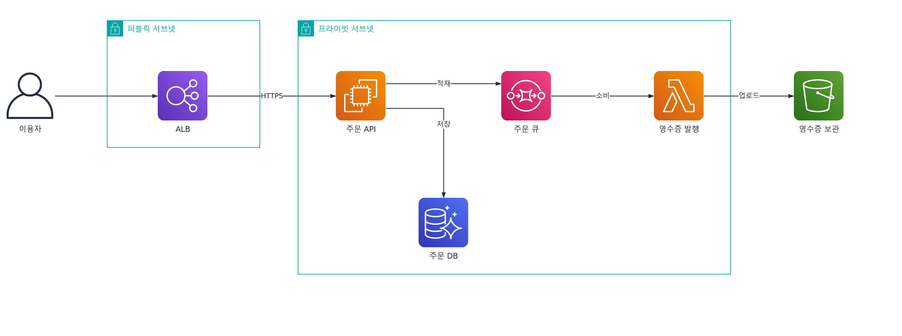
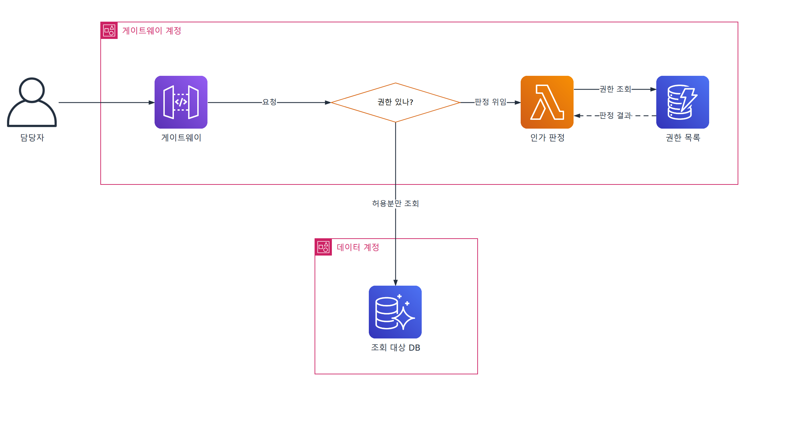

# archplot

[English](README.md) | [한국어](README.ko.md) | 简体中文 | [日本語](README.ja.md)

<p align="center">
  
  
</p>

用文字描述，就能画出带云厂商官方图标的架构图的 Claude Code 技能。
产出可直接在 draw.io 中打开编辑的 `.drawio` 文件和 PNG 图片。

## 特性

- **官方图标** — 涵盖 AWS、GCP、Azure、Kubernetes 等 17 个系列，共 2,440 个图标
- **边界框** — 账号、区域、VPC、子网可层层嵌套
- **整洁的连线** — 连线以直角连接，避开图形和文字
- **无需安装应用** — 不需要 draw.io 桌面版即可渲染 PNG

## 安装

```bash
npx skills add yujung7768903/archplot
```

需要 Python 3、`pip install diagrams` 和 Chromium。

## 用法

用文字向 Claude Code 描述想画的架构。

> 画一张架构图：订单 API 把订单放进 SQS，Lambda 取出后把收据上传到 S3

## 连线规则

连线按以下规则连接图形。

| 规则 | 原因 |
| --- | --- |
| 只做水平、垂直转折 | 曲线和斜线让流程难以阅读 |
| 能走直线就不转折 | 转折不携带信息 |
| 不穿过图形 | 看不清连线终点 |
| 不压过文字 | 名称会被遮住 |
| 不从图标的角上引出连线 | 连线看起来与图标脱节 |
| 进入的连线不共用连接点 | 重叠的线看起来像一条 |
| 没有整洁的路径时调整布局 | 不用斜线硬连 |

## 作图规则

取自 AWS 参考架构图。

- 一个资源一个节点
- 只有带图标的东西才成为节点 — 不画函数名、URL、字段名
- 连线标签 1~3 个词
- 用户放在所有边界框之外
- 只画一条正常流程 — 不画错误、重试和序号
